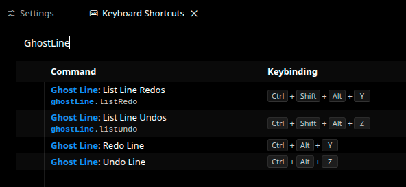

## **1. The Problem: Why Global Undo Fails Developers**

If you’ve been using VS Code long enough, you’ve probably had this moment:

You’re editing two different parts of a file.
You spot a typo on one line.
You hit `Ctrl + Z`.

Suddenly, something completely unrelated disappears.

Nothing is *technically* broken — but your flow is.

Global undo is **time-based**.
It rewinds your editor to a previous point in history, regardless of *what* you were trying to undo.

But developers don’t think in time.
We think in **intent**.

* “Undo this line”
* “Revert that typo”
* “Bring back what this line used to be”

Instead, global undo answers a different question:

> “What was the last edit operation?”

That mismatch is the entire reason **Ghost Line** exists.

---

## **2. How Ghost Line Works (Conceptually)**

Ghost Line doesn’t replace native undo.
It runs **alongside it**, without interfering.

The idea is simple:

> Treat each line as its own unit of history.

---

### **2.1 Line-Scoped History Instead of Global History**

Each open file maintains its own internal structure.
Within that, **each line owns its own history**:

* Undo stack
* Redo stack
* Current snapshot

Undoing a line affects **only that line**.
Everything else stays exactly as it is.

No file rewinds.
No collateral damage.

---

### **2.2 Snapshot-Based History (Not Diffs)**

Ghost Line stores **full snapshots of a line**, not diffs.

Why this matters:

* Predictable restores
* No partial corruption
* No diff math surprises

Snapshots are capped per line, so memory usage stays under control.

---

### **2.3 Idle-Based Snapshot Capture**

Capturing every keystroke would make history useless.

Ghost Line:

* Waits for a short idle period
* Then records a snapshot

This keeps history:

* Clean
* Meaningful
* Actually usable

You undo *states*, not noise.

---

### **2.4 Guarding Against Programmatic Edit Loops**

Undoing a line is itself a text edit.

If you don’t guard against it, the undo operation gets recorded as another change — and history eats itself.

Ghost Line explicitly separates:

* **User edits**
* **Programmatic restores**

Internal restores are guarded so they don’t pollute history or create recursive undo loops.

Most undo bugs aren’t undo bugs.
They’re feedback loops.

---

### **2.5 Using Ghost Line in Practice**

Using Ghost Line is intentionally boring — in a good way.

* Place your cursor on a line
* Undo or redo affects *only that line*
* Everything else remains untouched

You can also:

* Open a history picker
* Preview previous versions of the line
* Restore exactly what you want

Native VS Code undo still works.
Ghost Line doesn’t fight it — it complements it.

---

📽 **Short Clip – Line-Level Undo / Redo + History Picker**
*(Add a short GIF or MP4 showing: typing → undoing only one line → opening history picker → restoring an older snapshot)*

---

### **2.6 Configuration That Actually Matters**

Ghost Line keeps configuration minimal and purposeful:

* **Max history per line**
  Limits how many snapshots are stored per line.

* **Idle delay**
  Controls how aggressively snapshots are captured.

* **Shortcut toggle**
  Lets you disable Ghost Line keybindings without uninstalling the extension.

No settings bloat.
No micro-tuning obsession.

---

📸 **Screenshot – VS Code Settings (Ghost Line Configuration)**

---

📸 **Screenshot – Keyboard Shortcuts**

---

## **3. Edge Cases, Limitations, and Future Work**

---

### **3.1 Edge Cases Handled**

Some problems are unavoidable — but manageable:

* Line number shifts due to inserts or deletes
* Redo invalidation after new edits
* Safe no-ops when no history exists
* Zero interference with native VS Code undo

Ghost Line remaps history carefully to avoid corruption when the file structure changes.

---

### **3.2 Current Limitations**

Ghost Line is precise — not magical.

Right now:

* No block or range-based undo
* Multi-line edits aren’t first-class citizens
* History is session-scoped (not persisted across reloads)

This is intentional scope control, not missing ambition.

---

### **3.3 What’s Coming Next**

Planned improvements include:

* Hover previews for undo / redo states
* Better multi-line awareness

No timelines.
No promises.
Just direction.

---

## **4. Conclusion: Undo Should Respect Intent**

Global undo optimizes for simplicity.
Developers optimize for flow.

Ghost Line is an experiment in **intent-aware editing** — undoing what you *meant* to undo, not whatever happened last.

This kind of feature belongs in extensions first.
That’s where ideas get tested, broken, and refined.

If global undo ever gets smarter, great.
Until then, Ghost Line exists for those moments when precision matters.

---